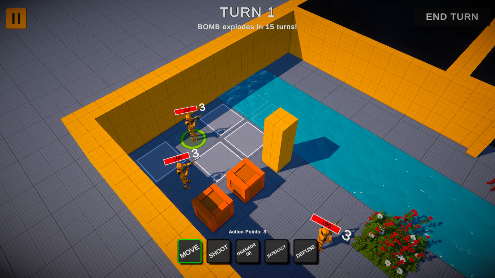
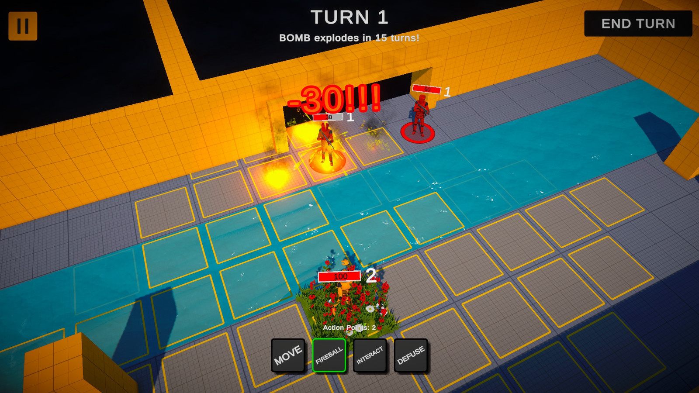
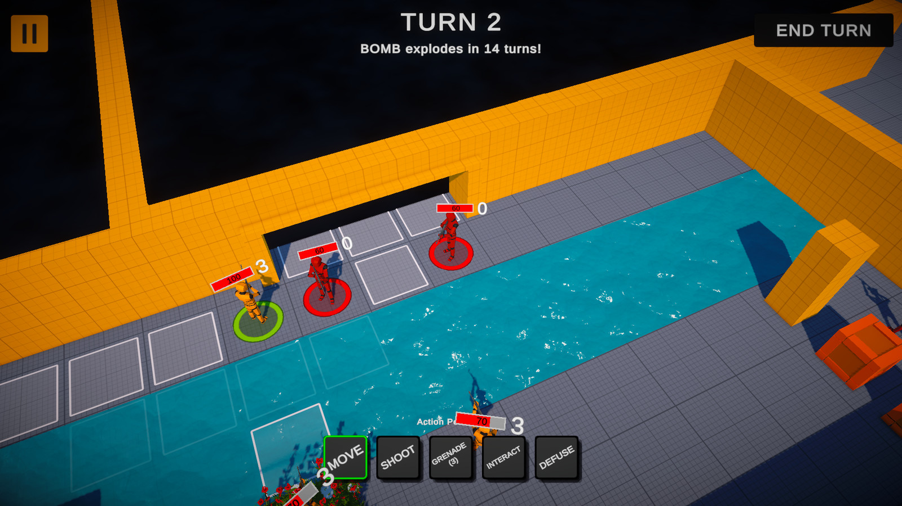
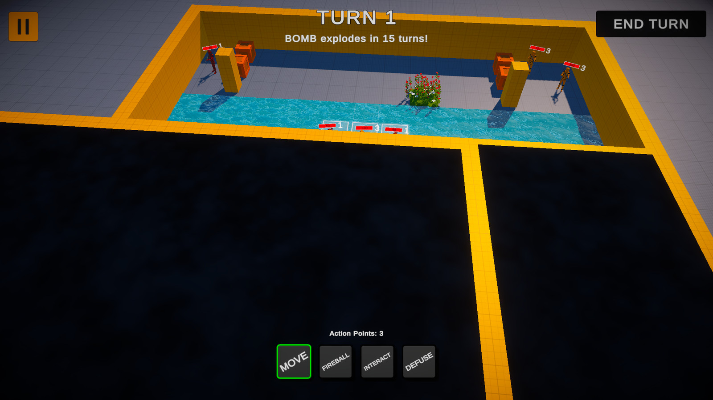
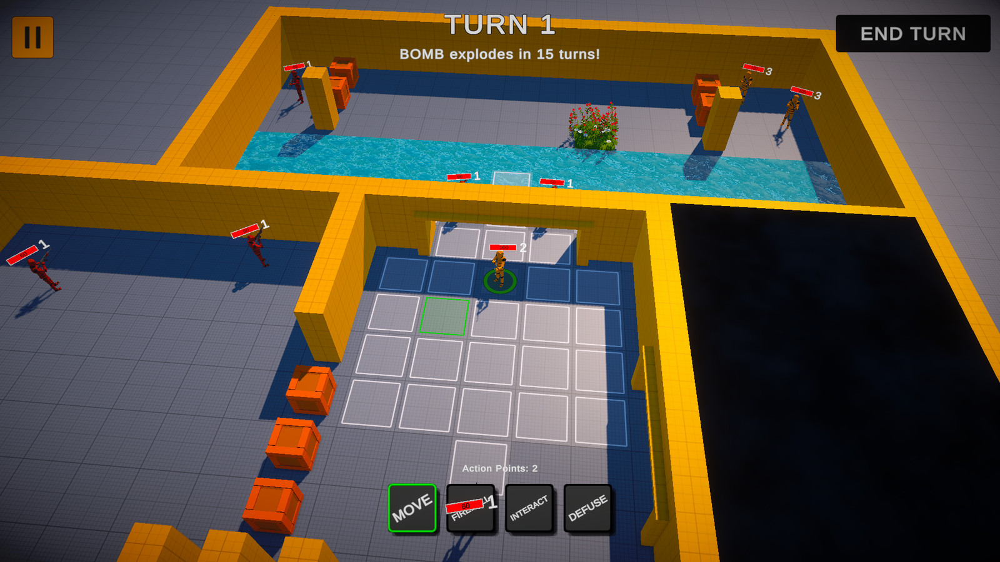
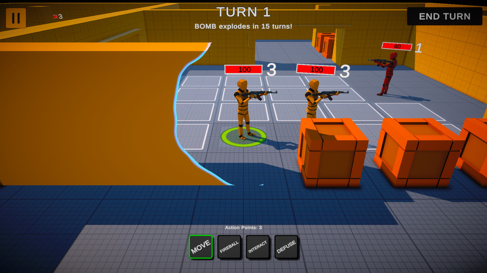

# StrategyGame — 3D Turn-Based Tactics

**Tactical enemy AI · Dynamic pathfinding · Reactive battlefield interactions**

Unity 2022.3 LTS · C# · Universal Render Pipeline · Personal project

[English](#english) · [简体中文](#简体中文)

## English

StrategyGame is a squad-based, turn-based tactics prototype developed in Unity. Command soldiers and a mage, manage action points, and reach the bomb before the turn countdown expires. The technical focus is tactical enemy AI: evaluating actions, planning short sequences, and reacting to changes in terrain and unit positions.

> This public portfolio contains core source code, technical documentation, and gameplay screenshots. Third-party source assets, scenes, and prefabs remain in the private Unity project, so this repository is not a standalone playable game. A playable download and videos are not published here yet.

### Technical highlights

- **Utility-based tactical AI:** score offense, survival, and positioning; tune decision weights through ScriptableObject profiles. A bounded, depth-two beam planner estimates follow-up actions when the action-point budget permits, executes the first step, then replans.
- **Budget-aware movement fields:** one bounded Dijkstra search produces reachable tiles, weighted movement costs, and a path reconstruction tree. Reusable flat arrays, a decrease-key binary min-heap, and topology/occupancy-versioned caching support repeated tactical queries.
- **Reactive battlefield:** water movement costs, grass concealment, fire hazards, doors, and destructible crates interact with movement and action selection.
- **Readable combat presentation:** selected-unit camera focus, local noise-dissolve wall cutouts that preserve shadows, impact feedback, and room fog that dissolves after a unit finishes moving.

Current demo tuning: **3 action points per player unit** and **60 HP per enemy**. Enemy action-point settings are unchanged.

### Screenshots

Gameplay frames from the current Unity project, using third-party prototype art. Click a screenshot to view it at a larger size.

#### Movement range and terrain

Reachable tiles are computed from the movement budget and terrain costs, then reused for path reconstruction.

#### Combat feedback and the enemy turn

| Fireball impact | Tactical enemy turn |
| --- | --- |
|  |  |
| Area damage, critical-hit feedback, and persistent fire hazards. | Utility-scored enemies select actions and targets during their turn. |

#### Room exploration: before and after

| Unexplored room | Revealed after arrival |
| --- | --- |
|  |  |
| Fog keeps the room and its enemies hidden. | Arrival triggers a noise-based dissolve and reveals the room. |

#### Keeping the selected unit visible

A local, animated cutout reveals the selected unit without hiding the entire wall or changing its shadow casting.

### Explore the implementation

| System | Entry points | Focus |
| --- | --- | --- |
| Movement search | [TacticalMovementField](Assets/Scripts/TacticalMovementField.cs) | Budgeted search, binary heap, parent tree, field cache |
| Dynamic grid | [PathFinding](Assets/Scripts/PathFinding.cs), [LevelGrid](Assets/Scripts/Grid/LevelGrid.cs) | Terrain, blockers, state versions, influence maps |
| Tactical planner | [TacticalPlanner](Assets/Scripts/TacticalPlanner.cs), [TacticalAIProfile](Assets/Scripts/TacticalAIProfile.cs) | Bounded beam search, profiles, per-action replanning |
| Action scoring | [MoveAction](Assets/Scripts/Actions/MoveAction.cs), [EnemyAIAction](Assets/Scripts/EnemyAIAction.cs) | Offense, survival, and positioning scores |
| Wall visibility | [CameraOcclusionDissolver](Assets/Scripts/CameraOcclusionDissolver.cs), [wall shader](Assets/Resources/Shaders/TacticalWallDissolve.shader) | Occlusion detection, local cutouts, preserved shadows |
| Room fog | [RoomTrigger](Assets/Scripts/RoomTrigger.cs), [Room](Assets/Scripts/Room.cs), [fog shader](Assets/Resources/Shaders/FogOfWarDissolve.shader) | Movement-completion event and noise dissolve |

See [architecture and implementation boundaries](docs/ARCHITECTURE.md) for details. The movement search is bounded Dijkstra, not Weighted A*. HPA*, voxel destruction, destructible walls, and AI breach planning are not implemented.

### Environment and controls

Unity **2022.3.62f2** · URP **14.0.12** · Cinemachine **2.10.5** · Input System **1.14.2**.

Left click selects units, actions, and targets. `WASD` moves the camera; `Q` / `E` or middle mouse rotates; the wheel zooms. `Tab` cycles actions, `Left Alt` cycles friendly units, `Space` ends the turn, and `Esc` pauses.

The full project starts at `MainMenuScene` and loads `Level1`. These scenes are not included in this source-only export; opening the public repository in Unity does not recreate the playable level.

### Project status and provenance

The current Unity build and selected gameplay scenarios have been checked, but a full automated regression suite and reproducible performance benchmarks are still pending. The planner is approximate rather than a full combat simulator; thick/overlapping walls, wall doors, and diagonal movement remain regression targets. No measured speedup percentage or whole-system zero-allocation claim is made.

The `legacy-import` tag marks a real import of an existing project previously managed with Unity Version Control, not a fabricated development history. Third-party art is not claimed as original, and no blanket open-source license is applied to the repository.

[Development archive](DEVELOPMENT.md) · [Third-party notices](THIRD_PARTY_NOTICES.md) · [Release checklist](docs/RELEASE.md)

---

## 简体中文

**战棋策略游戏与敌人战术 AI** · Unity / C# / URP · 个人项目

基于个人战棋原型持续迭代的小队制回合战术游戏。玩家控制士兵和法师，在有限行动点与回合倒计时内完成移动、攻击、技能施放和拆弹任务。项目重点是战术 AI：行动效用评估、短期行动组合规划，以及对地形与单位位置变化的响应。

> 本公开仓库提供核心源码、技术文档和实机截图。原始第三方美术、场景与预制体保留在私有 Unity 工程中，因此不能仅凭本仓库还原完整游戏。目前尚未在这里发布试玩包或演示视频。

### 技术亮点

- **战术决策**：Utility AI 按进攻、生存、站位分项评分，使用 ScriptableObject 配置不同决策风格；在行动点允许时，通过有界二层 Beam Search 估计后续行动，执行首步后重新规划。
- **动态路径规划**：有界 Dijkstra 一次构建可达范围、带权移动成本与路径父树；复用扁平数组和支持 decrease-key 的二叉最小堆，通过拓扑与占用版本管理范围场缓存。
- **战场交互**：水面移动代价、草地隐蔽、火焰危险、门与可破坏箱体参与移动和行动选择。
- **战场呈现**：选中单位镜头聚焦、保留投影的局部墙体噪波溶解、攻击命中反馈，以及角色移动结束后触发的房间迷雾消散。

当前演示数值：**玩家单位每回合 3 行动点，敌人 60 血量**；敌人的行动点配置保持不变。

### 游戏截图

上方 [截图展示](#screenshots) 包含 6 张实机画面，可点击图片放大查看。所有截图来自当前工程，原型美术使用第三方资源，不作为原创美术成果声明。

| 展示内容 | 截图 | 对应系统 |
| --- | --- | --- |
| 移动范围与地形 | [移动范围](docs/media/movement-range.jpg) | 基于移动预算和地形成本生成可达格子 |
| 战斗与敌方回合 | [火球反馈](docs/media/fireball-impact.jpg) · [敌方回合](docs/media/tactical-ai.jpg) | 范围伤害、暴击反馈、燃烧与自主行动选择 |
| 房间探索 | [迷雾揭开前](docs/media/fog-before.jpg) · [角色抵达后](docs/media/fog-reveal.jpg) | 保留未探索区域，抵达后播放噪波消散 |
| 遮挡处理 | [墙体局部溶解](docs/media/wall-cutout.jpg) | 显示被遮挡角色，保留墙体其余部分与原有投影 |

### 建议阅读顺序

| 主题 | 代码入口 | 看点 |
| --- | --- | --- |
| 搜索核心 | [TacticalMovementField](Assets/Scripts/TacticalMovementField.cs) | 预算搜索、二叉堆、父树与范围场缓存 |
| 动态状态 | [PathFinding](Assets/Scripts/PathFinding.cs)、[LevelGrid](Assets/Scripts/Grid/LevelGrid.cs) | 地形与障碍、占用/拓扑版本、影响力图 |
| AI 规划 | [TacticalPlanner](Assets/Scripts/TacticalPlanner.cs)、[TacticalAIProfile](Assets/Scripts/TacticalAIProfile.cs) | 二层候选搜索、权重配置、每步重规划 |
| 行动评分 | [MoveAction](Assets/Scripts/Actions/MoveAction.cs)、[EnemyAIAction](Assets/Scripts/EnemyAIAction.cs) | 进攻、生存与站位分项 |
| 墙体遮挡 | [CameraOcclusionDissolver](Assets/Scripts/CameraOcclusionDissolver.cs)、[Shader](Assets/Resources/Shaders/TacticalWallDissolve.shader) | 遮挡检测、局部切口与独立投影 |
| 房间迷雾 | [RoomTrigger](Assets/Scripts/RoomTrigger.cs)、[Room](Assets/Scripts/Room.cs)、[Shader](Assets/Resources/Shaders/FogOfWarDissolve.shader) | 移动完成事件与噪波消散 |

当前寻路实现是有界 Dijkstra 范围场，而非 Weighted A*。HPA*、体素破坏、墙体破坏及 AI 炸墙策略尚未实现，详见 [架构说明](docs/ARCHITECTURE.md)。

### 环境与操作

Unity **2022.3.62f2** · URP **14.0.12** · Cinemachine **2.10.5** · Input System **1.14.2**。编辑器版本与包依赖分别记录在 `ProjectSettings` 与 `Packages` 中。

鼠标左键选择单位、动作与目标；`WASD` 移动镜头，`Q` / `E` 或中键旋转，滚轮缩放；`Tab` 切换动作，左 `Alt` 切换单位，`Space` 结束回合，`Esc` 暂停。

完整工程从 `MainMenuScene` 进入 `Level1`。本公开源码仓库不包含这些场景，不能直接打开后试玩；导入代码时仍需配置场景、组件引用、合法素材及渲染环境。

### 当前状态与开发记录

已检查当前 Unity 构建及部分核心演示场景，但尚未建立完整自动化回归与可复现性能基准。二层 AI 属于近似规划，并非完整战斗模拟；厚墙、重叠墙体、墙门遮挡和对角移动仍需持续回归。不宣称未经测量的性能提升比例或全系统零 GC。

`legacy-import` 标签记录既有项目从 Unity Version Control 迁移到 Git 的真实快照，不伪造早期提交历史。第三方美术不作为原创成果声明，当前也未为整个仓库附加统一开源许可。

后续重点是自动化回归、性能评估，以及模块化墙体破坏与 AI 的破坏/绕路成本决策。

[开发归档](DEVELOPMENT.md) · [第三方资源说明](THIRD_PARTY_NOTICES.md) · [发布与验证清单](docs/RELEASE.md)
